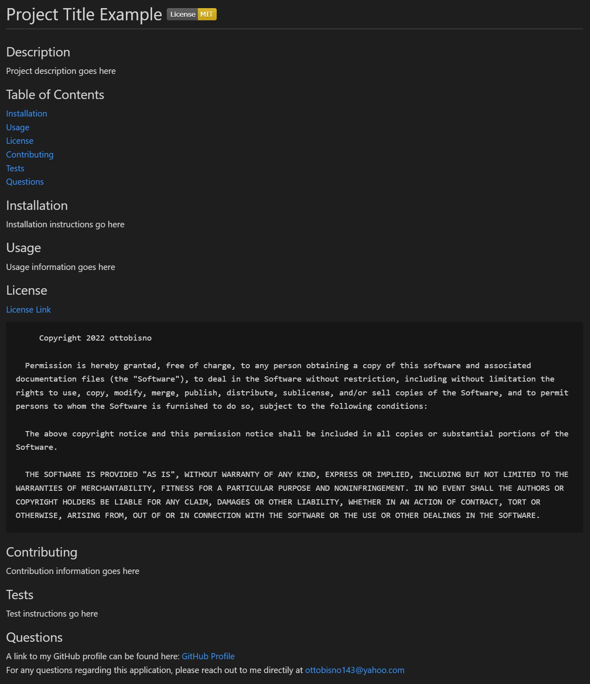

# README-generator

## Description

This application allows the user to generate a README.md file for their own repository by simply running the application and answering a handful of questions. The sections provided by the template include Description, Table of Contents, Installation, Usage, License, Contributing, Tests, and Questions. Depending on which license is chosen, a badge for that license will also appear at the top of the generated README.md file.

## Motivation

Creating README.md files for your repositories can be a pain and take up time that could be spent working on other aspects of one's project. The motivation for this aplication was to help reduce the workload involved with creating a README.md file and act as a template for such cases.

## Future Improvements

This template is currently very specific in terms of which sections are included. I would lie to update this application in the future to allow the user to specify which sections they would like to include in the README.md file in addition to the contents.

## Demonstration

[Link to video demonstrating the application's functionality](https://app.castify.com/view/81a3620d-698f-4248-93aa-528d8b3f5f33) 

Image of example generated README.md file:

## Questions

For any questions, please reach out to [ottobisno143@yahoo.com](mailto:ottobisno143@yahoo.com)